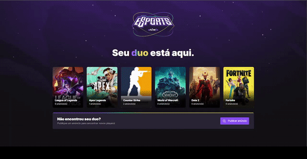
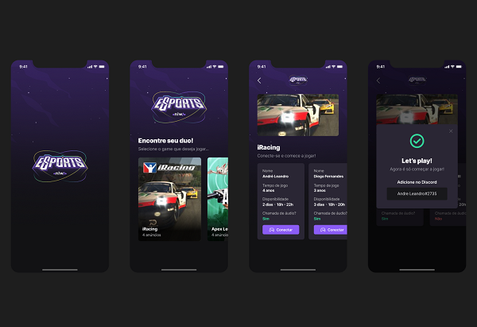

# <p align="center"></p>

# <p align="center"> Find your duo </p>


Full stack project developed during the NLW eSports week of [Rocketseat](https://www.rocketseat.com.br).


## 💁🏻‍♂️ Demonstration

<p align="center">

</p>

## 📱 Mobile

<p align="center"></p>


## ▶️ Running locally

Clone the project

```bash
    https://github.com/ricardodev10/find-your-duo.git

    git@github.com:ricardodev10/find-your-duo.git
```

Enter the backend directory

```bash
    cd server
```

install the dependencies

```bash
    npm install
```


## 📚 Learnings

Consolidating concepts with React and TypeScript, knowing TailwindCSS, ReactNative and several libraries used in this project.
Advancing to the next level with these learnings.


## ♻️ Functionalities

- Find your duo
- Ad listing
- For games


## 🛠 Tech stacks used

> Front-end: 

- [React](https://reactjs.org/)
- [TypeScript](https://www.typescriptlang.org/)
- [TailwindCSS](https://tailwindcss.com/)
- [Radix UI](https://www.radix-ui.com/)
- [Vite](https://vitejs.dev/)

> Back-end: 

- [Node](https://nodejs.org/en/)
- [Express](https://www.npmjs.com/package/express)
- [Prisma](https://www.prisma.io/express)

> Mobile

- [ReactNative](https://reactnative.dev/)
- [Expo](https://expo.dev/)
- [Phosphoricons](https://phosphoricons.com/)


## 📈 Improvements

Refactorings, performance and accessibility.


## 🙂 Feedback

If you have any feedback, please send it to me at ricardodev10@yahoo.com


## 💛 Author

- [Ricardo Junior](https://www.linkedin.com/in/ricardodev10/)